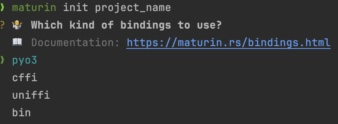
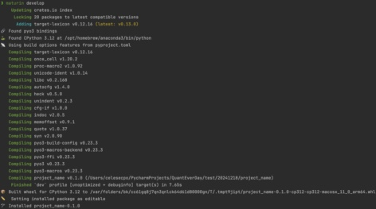
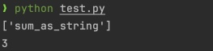

# use pyo3

> Github: https://github.com/PyO3/pyo3
>
> Guide: https://pyo3.rs/

The Fast Solution

+ You need prepare the environment of rust and python
+ ```
  pip install maturin
  ```
+ ```
  maturin init project_name
  ```
  
+ ```
  cd project_name && maturin develop
  ```
  
+ You can test you python lib "project_name"
+ ```
  # test.py
  import project_name
  print(project_name.__all__)
  print(project_name.sum_as_string(1,2))
  ```
  
+ if you edited your rust file,you can run 'maturin develop' to recreate your py lib
+ 'maturin build' can help your create .whl file and publish your lib
  
